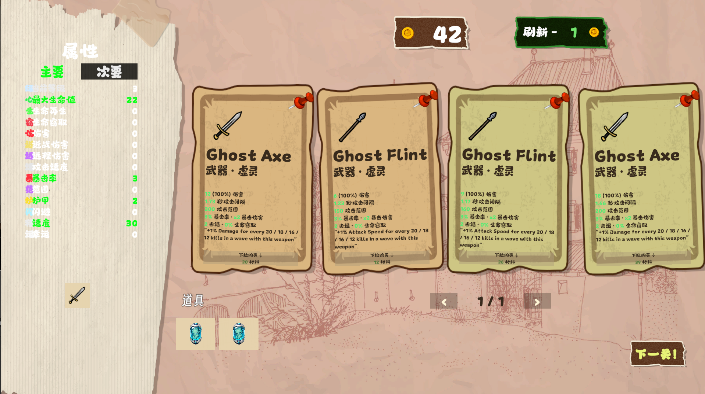

# 土豆商店原型

## 当前运行画面



截至 2026-09-13，这张运行截图可确认场景已显示四张商品卡、材料数量、刷新费用、图钉锁定入口、玩家属性栏、武器/道具背包、翻页控件和“下一关”入口。

截图不能替代交互验收。向下拖动购买、锁定后刷新保留、详情、合成、回收、翻页、读档以及进入下一波仍需分别在 Play Mode 验证。卡片当前显示 `Ghost Axe`、`Ghost Flint` 等英文名称，与中文界面混排，属于待统一的展示问题。

## 运行时结构

- `ShopContentDefinition` 是武器和道具共用的展示模型。
- `ShopWeaponDefinition` 和 `ShopItemDefinition` 分别保存武器、道具字段。
- 每个具体武器或道具都由 XLSX 生成单独脚本，统一放在 `Generated` 下；不要手改生成文件。
- `ShopContentCatalog` 只注册 `GeneratedShopContentCatalog` 中的 XLSX 生成内容。
- `ShopManager` 随机刷新商品，并将数据绑定到 `ShopOfferView`。

图标不是必填项。定义脚本通过 `IconResourcePath` 绑定 `Assets/Resources` 下的 Sprite；
素材缺失时卡片会自动显示“武”或“道”占位符。

## 打开和关闭商店

早期测试用的临时界面生成器已经移除，现在商店 UI 只由场景里的 `ShopManager` 控制。
正式项目中把 `ShopManager` 挂到你的商店控制对象上，然后通过这些接口控制显隐：

```csharp
shopManager.OpenShop();
shopManager.CloseShop();
shopManager.ToggleShop();
shopManager.SetShopOpen(true);
```

推荐让 `ShopManager` 挂在一个常驻激活的父物体上，把真正需要隐藏的商店面板拖到
`Shop Window Root`。如果不拖，默认会控制 `ShopManager` 所在物体。

## 生成 ShopItem 预制体

运行：

`Tools > Potato Shop > Create ShopItem Prefab Template`

这会生成 `Assets/Prefebs/ShopItem.prefab`。模板尺寸固定为 `450 x 600`，武器与道具共用。
所有文本会自动绑定项目中的中文 TMP 字体。可以自由调整视觉效果，但请保留以下节点名称：

```text
ShopItem                 Image, Button, ShopOfferView
|- IconPanel             Image
|  `- Icon               Image
|     `- IconPlaceholder TextMeshProUGUI
|- NameText              TextMeshProUGUI
|- KindText              TextMeshProUGUI
|- LimitText             TextMeshProUGUI
|- DescriptionText       TextMeshProUGUI
|- StatsText             TextMeshProUGUI
`- PricePanel            Image
   `- PriceText          TextMeshProUGUI
```

`ShopOfferView` 会按节点名称自动绑定引用，不需要逐个拖拽字段。有限购数量的道具会显示
`限制 (0/N)`；无限制道具和武器会自动隐藏这一行。

然后配置商店界面：

1. 在商店根对象添加 `ShopManager`。
2. 创建空 UI 对象并命名为 `ShopItemContainer`，在编辑模式下放好 4 张商品卡片。
3. 每张卡片预先配置图标、名称、类型、限购、描述、属性、价格、查看、购买和锁定按钮。
4. 将这 4 个 `ShopOfferView` 按显示顺序拖到 `ShopManager > Offer Views`，数量与 `Offer Count` 一致。
5. 将刷新按钮命名为 `RefreshButton`，或拖到 `ShopManager > Refresh Button`。
6. `Start Open` 控制商店开局是否显示。

`SampleScene` 已配置 `Shop/ShopItemContainer/ShopItem 1` 到 `ShopItem 4`，运行时只绑定数据和控制显隐。
`Shop/ShopContentDetailPopup` 是商品和背包共用的描述对象；其图标、标题、类型、详情和关闭按钮均已绑定。
在编辑模式中临时启用该对象即可调整描述布局，保存前保持禁用。

商店根对象还需要预先配置 `CanvasGroup` 和 `PlayerCurrencyDisplay`。
武器背包使用 6 个 `ShopBagSlotView`，道具背包使用 18 个固定格子及上一页、下一页按钮；
购买、合成、翻页和读档都会复用这些对象，不创建或销毁 UI。翻页只影响显示，不改变存档中的物品列表。

具体武器和道具脚本是普通 C# 数据定义，不需要挂到 GameObject 上。

## XLSX 批量生成

将 `weapons.xlsx` 和 `items.xlsx` 放在项目根目录，然后运行：

`Tools > Potato Shop > Generate Scripts From XLSX`

编辑器导入器会把 `Assets/Scripts/Shop/Generated` 与当前表格做完整同步：为每个有效数据行生成脚本，
删除表格中已不存在的旧 `.generated.cs`，并重新构建 `GeneratedShopContentCatalog.generated.cs`。
导入前会先读取并校验两张表；如果文件被占用到无法读取、缺少必需列或存在重复 ID，生成会直接失败，
并保留原有生成脚本。商店目录只注册生成代码，`items.xlsx` 是道具定义的唯一数据源。

`items.xlsx` 中每个非零属性单元格都必须能映射到现有整数型 `PlayerStats`；未知属性列、无效或非整数数值、
超出 Tier 1～4 的稀有度、非法价格或限购会让生成失败，避免错误道具进入商店或只应用部分效果。
道具图片按名称读取 `Resources/IconImage/Items/<道具名小写并以连字符分隔>`。
