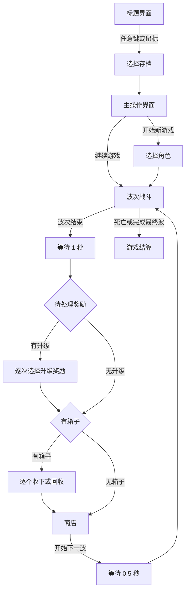

# Potato

一款使用 Unity 制作的 2D 俯视角波次生存游戏原型。玩家选择角色进入一局游戏，在限时波次中自动攻击敌人、收集材料并升级；每波结束后依次处理升级奖励与箱子奖励，再进入商店整备，最终完成第 20 波或在死亡后进入结算。

> 当前阶段：核心玩法闭环已经连通，处于内容扩充、敌人差异化、武器特殊效果和整体表现打磨阶段。

## UI 风格

菜单使用暖色复古纸张风格：线稿建筑背景、撕纸边缘、胶带、图钉与手绘标记构成主要视觉语言。战斗场景则保留清晰的像素俯视角表现。菜单中的选中状态主要通过箭头、贴图切换和页面圆点反馈，键盘与鼠标共享同一套页面逻辑。

### 角色选择视觉基底


### 存档选择组件


### 角色立绘示例

<p align="center">
  
</p>

以上图片均直接引用项目中的现有 UI 素材；实际页面由 Unity 场景内的 Image、Button 与 TextMeshPro 组件组合。

## 游戏流程



波次结束时，玩家会恢复至满生命，存活敌人和场上掉落物会被清理。未拾取材料会转为“储存材料”，下一波按照储存数量补充等量的双倍材料掉落。

## 当前已实现

| 模块 | 当前内容 |
| --- | --- |
| 主菜单与导航 | 标题、三槽存档选择、主操作、角色选择、设置页面；使用 `UIRouter` 与返回栈维护页面层级 |
| 存档 | JSON 正式文件、临时文件与备份文件；支持损坏恢复、删除存档和继续当前 Run |
| 角色 | 数据驱动角色目录；当前配置 4 个角色，初始可用角色为“薄荷”，初始武器为木棍 |
| 玩家 | 移动、自动索敌、生命、受伤、死亡、基础战斗属性与运行时状态栏 |
| 武器 | 最多 6 把武器、装备同步、同类同品质合成；斩击、突刺、远程三种基础攻击模板 |
| 波次与敌人 | 波次计时、刷怪计划、地图边界、出生提示、敌人对象池、接触伤害与击退 |
| 掉落与经验 | 材料、水果、箱子；材料同时提供经验，水果治疗，箱子进入波后奖励队列 |
| 升级 | 波后统一处理待升级次数，每次提供 4 个随机属性选项，品质受等级与幸运影响 |
| 箱子奖励 | 波后逐个展示，可收下道具或回收为材料 |
| 商店 | 4 个随机商品、刷新费用、免费刷新、锁定、购买限制、负担能力反馈和右键详情 |
| 暂停与结算 | `Esc` 暂停、暂停设置、返回主菜单；支持死亡失败与最终波胜利结算 |

当前内容数据规模：

- 231 个道具定义。
- 156 个武器等级定义。
- 66 个敌人定义：22 个普通敌人、8 个精英、2 个 Boss，以及 34 个 DLC 分类敌人。
- 4 个角色定义；除“薄荷”外的角色目前保持锁定并预留白模与配置接口。

数据条目数量不等同于独立玩法完成度。部分武器和敌人已有完整描述与数值，但仍复用基础攻击模板或追踪 AI。

## 操作方式

| 页面/状态 | 键盘 | 鼠标 |
| --- | --- | --- |
| 标题界面 | 任意键进入 | 任意鼠标键进入 |
| 存档选择 | `A/D` 或左右键切换槽位；`W/S` 切换存档与删除；`Space` 执行；`Esc` 返回 | 悬停选择，左键执行；删除模式中右键退出 |
| 主操作界面 | `W/S` 或上下键移动；`Space` 确认；`Esc` 返回 | 悬停移动箭头，左键选择 |
| 角色选择 | `A/D` 或左右键切换；`Space` 开始；`Esc` 返回 | 左右按钮切换，点击按钮开始/返回 |
| 战斗 | `WASD` 或方向键移动；武器自动索敌攻击 | — |
| 暂停 | `Esc` 打开或返回上一层 | 点击对应按钮 |
| 商店背包 | — | 右键已购买的武器或道具查看详情 |

没有进行中的游戏时，`Continue` 会变暗并不可选择；有有效 Run 时可直接恢复保存的战斗、波后或商店阶段。

## 角色配置

角色由 `CharacterDefinition` ScriptableObject 驱动，资源位于 `Assets/Resources/Characters`。每个角色可独立配置：

- 稳定且唯一的角色 ID 与显示顺序。
- 名称、类型、说明与角色立绘。
- 是否在选择页显示、是否已经解锁。
- 初始武器 ID、显示名称与属性修正列表。

页面圆点数量根据角色目录自动决定，选择页无需为每个角色单独编写逻辑。

| 角色 | 定位 | 初始武器 | 状态 |
| --- | --- | --- | --- |
| 薄荷 | 均衡型 | 木棍 | 已解锁 |
| 斗士 | 近战型 | 小刀 | 已配置，暂未解锁 |
| 游侠 | 精准型 | 长矛 | 已配置，暂未解锁 |
| 幸运星 | 幸运型 | 石头 | 已配置，暂未解锁 |

## 技术结构

项目使用 Unity 传统 Input Manager、uGUI 与 TextMeshPro。主要目录如下：

```text
Assets/
├─ Arts/                       # 当前菜单、角色与纸张风格素材
├─ Prefebs/                    # 战斗、商店、HUD 与掉落物预制体
├─ Resources/
│  ├─ Characters/             # CharacterDefinition 角色数据
│  ├─ Enemy/                  # 敌人显示素材
│  ├─ IconImage/              # 商店内容图标
│  ├─ UI/                     # 通用 UI 框体与按钮素材
│  └─ Weapon/                 # 武器图标、模板与初始武器
├─ Scenes/
│  ├─ MainMenu.unity          # 标题、存档、主操作、角色选择与设置
│  └─ SampleScene.unity       # 战斗、波次、奖励、商店与结算
├─ Scripts/
│  ├─ UI/                     # 菜单路由、HUD、暂停与结算
│  ├─ Player/                 # 玩家状态、角色数据与掉落拾取
│  ├─ Weapon/                 # 武器基类、攻击模板与装备同步
│  ├─ Enemy/                  # 敌人目录、对象池、刷怪与波次流程
│  ├─ Progression/            # 经验、升级与箱子奖励
│  └─ Shop/                   # 商店内容、背包、卡片与购买逻辑
└─ Editor/                    # 场景装配、Prefab 创建与 XLSX 导入工具
```

### 关键运行时职责

- `UIRouter`、`UIScreen`、`UINavigationStack`：页面注册、进入、暂停、恢复和逐层返回。
- `SaveContext`：选择当前存档槽，并维护 `save.json`、备份和临时文件。
- `GameSessionState`、`RunSaveController`：保存和恢复当前 Run，区分战斗、波后和商店阶段。
- `EnemySpawner`：负责波次计时、出生警告、敌人生成、波后奖励链与商店切换。
- `CharacterCatalog`、`ShopContentCatalog`、`EnemyCatalog`：集中提供数据驱动内容。
- `PlayerWeaponEquipment`、`WeaponBag`：让背包内容与场上实际武器保持一致。

## 存档说明

存档根目录使用 `Application.persistentDataPath`。每个槽位拥有独立目录：

```text
save_slot_1/
├─ save.json
├─ save.backup.json
├─ run_save.json
└─ run_save.backup.json
```

运行存档包含角色、当前阶段、波次、击杀数、游玩时间、生命、位置、材料、储存材料、经验、待处理升级、箱子、属性、武器、道具和商店状态。主音量与全屏设置仍由 `PlayerPrefs` 保存。

## 运行项目

1. 使用 Unity Hub 添加项目根目录。
2. 使用 **Unity 2022.3.62f2c1** 打开项目。
3. 打开 `Assets/Scenes/MainMenu.unity`。
4. 进入 Play Mode，从标题界面开始测试完整流程。

Build Settings 中已按顺序加入：

1. `Assets/Scenes/MainMenu.unity`
2. `Assets/Scenes/SampleScene.unity`

主要依赖为 Unity 2D、uGUI 和 TextMeshPro，版本记录在 `Packages/manifest.json`。

## 扩展内容

### 新增角色

在 `Assets/Resources/Characters` 创建 `Potato/Character Definition`，配置唯一 ID、显示顺序、立绘、初始武器和属性修正。`CharacterCatalog` 会自动加载并排序，角色页和页面圆点会随可见角色数量更新。

### 更新商店数据

根目录的 `weapons.xlsx` 与 `items.xlsx` 是批量内容来源。在 Unity 中执行：

```text
Tools > Potato Shop > Generate Scripts From XLSX
```

生成内容位于 `Assets/Scripts/Shop/Generated`。更具体的节点约定与 Prefab 配置见 `Assets/Scripts/Shop/README.md`。

### 调整波次和掉落

`EnemySpawner` 暴露最终波数、波次计划、商店延迟、下一波缓冲、出生范围与预警时长。水果和箱子概率来自敌人定义，具体 Prefab 绑定在场景或敌人掉落组件中完成。

## 尚未完成

- 武器爆炸、燃烧、弹射、穿透、连锁闪电、炮塔等特殊效果尚未形成完整的统一运行框架。
- 部分玩家属性已经能保存和显示，但尚未全部接入实际战斗计算。
- 66 个敌人以数据录入为主，实际独立 Prefab 和专属行为仍较少；精英与 Boss 需要继续制作。
- 斗士、游侠和幸运星仍缺少正式立绘，并保持锁定状态。
- 主操作页的 `Stats` 入口已参与选择导航，但统计页面逻辑仍待接入。
- 材料、水果和箱子尚未统一接入对象池。
- 攻击特效、命中反馈、音效、分辨率适配和完整 20 波平衡仍需持续打磨。
- 当前没有自动化玩法测试，主要依赖 Unity Play Mode 验证。

推荐后续优先级：统一武器特殊效果框架 → 补全属性生效 → 制作精英/Boss 行为 → 完善战斗反馈与对象池 → 进行完整流程测试和数值平衡。

## 相关文档

- [项目进度记录](PROJECT_PROGRESS.md)
- [UI 导航设计说明](<Potato%20UI%20Navigation%20Agent.md>)
- [商店系统说明](Assets/Scripts/Shop/README.md)

## 资源说明

本仓库目前用于游戏原型开发。项目内原创素材、参考数据与第三方资源可能适用不同授权；进行公开发布或商业使用前，请逐项确认素材来源与许可范围。
