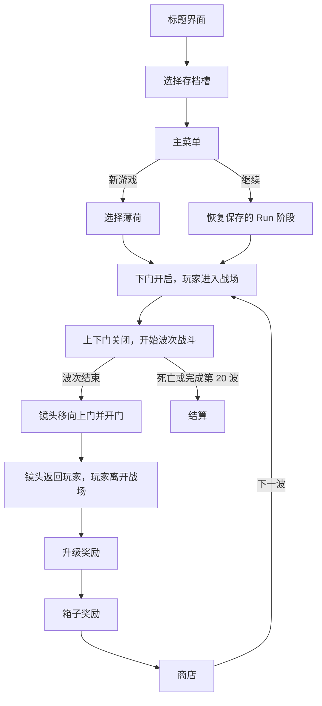

# Potato

Potato 是一个使用 Unity 制作的 2D 俯视角波次生存游戏原型。当前目标是维护一条小而稳定的可玩流程：

`标题界面 → 存档槽 → 主菜单 → 角色选择 → 波次战斗 → 升级/箱子奖励 → 商店 → 下一波 → 结算`

项目使用 Unity `2022.3.62f2c1`、uGUI、TextMeshPro 和传统 Input Manager。主要场景是：

- `Assets/Scenes/MainMenu.unity`
- `Assets/Scenes/SampleScene.unity`

当前正式可玩角色是“薄荷”，初始武器是“木棍”，一局默认共 20 波。

## 当前范围

本文档按正常游玩状态区分内容，导入的数据条目不等同于已完成玩法。

| 状态 | 内容 |
| --- | --- |
| **Implemented** | 标题、三槽存档、主菜单、角色选择；薄荷与木棍；玩家移动、自动索敌、生命、伤害和死亡；波次计时与刷怪；材料、经验、水果和箱子；波后升级、箱子奖励、商店和下一波；暂停与胜负结算 |
| **Partial** | 新地图边界、相机边界与墙体；玩家保持竖直且出生位置会限制在有效区域内；每波开始时下门先开启让玩家入场，随后上下门一起关闭；波末虚拟相机移向上门并播放开门，再返回玩家。代码、素材和场景已连接，等待连续波次 Play Mode 回归 |
| **Partial** | 商店商品卡和详情对象预先放在 SampleScene 中；背包通过 `IPlayerWeaponLoadout` 作为武器状态来源，手持武器只重建表现。购买、合成、保存和恢复仍需整体验收 |
| **Partial** | MainMenu 与 SampleScene 使用同一套纸张风格设置界面，主音量为 10 档整数步进；`bups 2` 与 `ShanHaiNiuNaiBoBoW-2 SDF` 已启用动态多图集并配置回退字体；角色移动时只有 `PlayerSkin` 做纸片式跳动。字体显示和动作手感仍需 Play Mode 确认 |
| **Partial** | 运行存档能区分战斗、波后和商店阶段，但不能据此宣称精确恢复波内剩余时间、刷怪进度和全部临时对象状态 |
| **Partial** | `items.xlsx` 是商店道具的唯一数据源，受支持的结构化属性会生成并应用到 `PlayerStats`；描述中的特殊行为、部分武器效果、敌人专属行为和角色配置仍未全部完成 Play Mode 验收 |
| **Reference only** | `weapons.xlsx`、未启用的生成定义以及大量敌人资料是开发参考；未通过获取、行为、资源、保存和 Play Mode 验收的条目不会算作可玩内容 |
| **Out of scope** | 完整复刻原作内容、DLC 敌人、未请求的精英/Boss、多人、在线服务、成就、平台 SDK 和大型框架重写 |

## 游戏流程



波次结束时会停止刷怪、清理本波战场对象、处理未拾取掉落并恢复玩家生命。奖励队列结束后才打开商店。开始下一波时，下门开启让角色从下方进入，随后上下门一起关闭；波次结束后会暂时锁定玩家，虚拟相机移动到上门并播放开门效果，再平滑返回玩家并允许离场。

## 操作

| 页面或状态 | 键盘 | 鼠标 |
| --- | --- | --- |
| 标题界面 | 任意键进入 | 任意鼠标键进入 |
| 存档选择 | `A/D` 或左右键切换槽位，`W/S` 切换操作，`Space` 确认，`Esc` 返回 | 悬停选择，左键执行 |
| 主菜单 | `W/S` 或上下键选择，`Space` 确认，`Esc` 返回 | 悬停和左键选择 |
| 角色选择 | `A/D` 或左右键切换，`Space` 开始，`Esc` 返回 | 点击左右按钮、开始或返回 |
| 战斗 | `WASD` 或方向键移动，武器自动索敌攻击 | 无必要操作 |
| 暂停/设置 | `Esc` 打开、返回上一层或继续 | 点击按钮；音量按 10 档调整 |
| 商店背包 | — | 右键武器或道具查看详情 |

没有进行中的 Run 时，`Continue` 会禁用；存在有效 Run 时可恢复已保存的阶段。

## 主要实现

- `PlayerController` 负责输入、刚体速度、旋转冻结和地图边界限制。
- `PlayerVisuals` 负责朝向和纸片跳动，只修改显示子对象。
- `ArenaGateController` 使用场景中预先创建的上下门显示对象和相机焦点，负责下门入场、双门封闭、波末上门动画与虚拟相机展示。
- `EnemySpawner` 负责波次计时、刷怪计划、波次结束和波后流程协调。
- `WeaponBag` 实现 `IPlayerWeaponLoadout`，保存可写武器状态；`PlayerWeaponEquipment` 监听变化并生成战斗表现。
- `ShopManager` 使用场景中预先绑定的商品卡、详情面板、背包和按钮。
- `SteppedVolumeSlider` 统一主菜单与暂停设置中的 10 档音量值。
- `bups 2` 与 `ShanHaiNiuNaiBoBoW-2 SDF` 使用动态多图集和回退字体补充缺失字形。
- `UIRouter`、`UIScreen` 和 `UINavigationStack` 维护菜单层级与 `Esc` 返回行为。
- `SaveContext`、`RunSaveController` 和 `GameSessionState` 保存槽位和当前 Run 阶段。

## 项目结构

```text
Assets/
├─ Arts/                 # 地图、角色、菜单和商店素材
├─ Prefebs/              # 敌人、掉落物、商店卡片和 HUD 预制体
├─ Resources/            # 运行时允许加载的角色、武器、图标和定义
├─ Scenes/
│  ├─ MainMenu.unity     # 标题、存档、主菜单、角色选择和设置
│  └─ SampleScene.unity  # 地图、战斗、奖励、商店和结算
├─ Scripts/
│  ├─ Player/            # 玩家移动、生命、属性和拾取
│  ├─ Weapon/            # 武器接口、装备表现和攻击模板
│  ├─ Enemy/             # 波次、门、刷怪、敌人行为和对象池
│  ├─ Progression/       # 经验、升级和箱子奖励
│  ├─ Shop/              # 商品目录、商店、背包和详情
│  └─ UI/                # 菜单、暂停、HUD、设置和结算
└─ Editor/               # 场景装配、预制体创建和数据导入工具
```

## 运行项目

1. 使用 Unity Hub 添加项目根目录。
2. 使用 Unity `2022.3.62f2c1` 打开项目。
3. 打开 `Assets/Scenes/MainMenu.unity`。
4. 进入 Play Mode，从标题界面测试完整流程。

Build Settings 已按顺序包含 MainMenu 和 SampleScene。

## 内容接入规则

新武器、道具、敌人或角色只有在以下条件通过后才能标记为 **Implemented**：

- 能通过预期流程获得或进入战斗。
- 描述、数值和实际行为一致。
- ID 和资源引用有效，缺失时能明确报错。
- 购买、装备、合成、移除、保存和读取不会造成状态分叉。
- 对象池复用会重置状态与事件。
- 已在 Play Mode 完成对应流程验证。

表格数据可通过 `Tools > Potato Shop > Generate Scripts From XLSX` 更新生成代码。`items.xlsx` 中通过属性校验的道具会进入商店和道具奖励池；描述中的特殊行为仍需完成对应运行时代码和 Play Mode 验收，不能只凭生成成功视为已实现。

## 文档

- [项目进度与验收状态](PROJECT_PROGRESS.md)
- [UI 导航设计说明](<Potato%20UI%20Navigation%20Agent.md>)
- [商店系统说明](Assets/Scripts/Shop/README.md)

项目中的原型数据和第三方素材可能适用不同授权。公开发布或商业使用前，需要逐项确认素材、名称、描述和参考数据的许可与替换计划。
