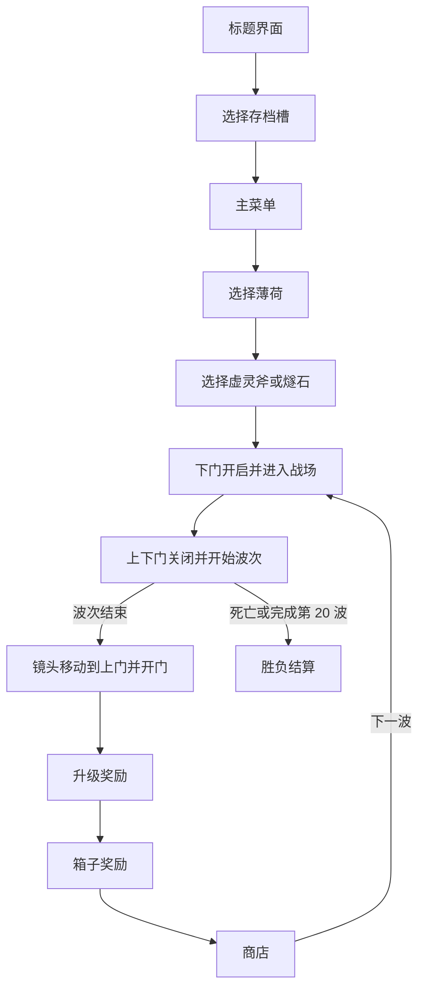

# Potato

Potato 是一个使用 Unity 制作的 2D 俯视角波次生存游戏原型。当前目标是维护一条小而稳定的可玩流程：

`标题界面 → 存档槽 → 主菜单 → 角色与初始武器选择 → 波次战斗 → 升级/箱子奖励 → 商店 → 下一波 → 结算`

项目使用 Unity `2022.3.62f2c1`、uGUI、TextMeshPro 和传统 Input Manager。主要场景为：

- `Assets/Scenes/MainMenu.unity`
- `Assets/Scenes/SampleScene.unity`

当前正式角色是“薄荷”。新 Run 可选择“虚灵斧”或“燧石”作为初始武器，一局默认 20 波。

## 当前范围

| 状态 | 内容 |
| --- | --- |
| **Implemented** | 标题、三槽存档、主菜单、角色选择；玩家移动、自动索敌、生命、伤害和死亡；基础敌人与掉落；经验、材料、水果和箱子；基础商店与暂停流程 |
| **Partial** | 新地图边界、门动画、波末镜头、波次衔接；虚灵斧/燧石初始选择；统一武器负载、合成与回收；下拉卡牌购买与图钉锁定；升级、箱子和胜负结算场景 UI；设置界面、字体与纸片跳动；运行存档恢复。代码、资源或场景已经连接，但仍需完整 Play Mode 回归 |
| **Reference only** | `weapons.xlsx`、`items.xlsx`、未启用的生成定义及未接入的敌人资料。没有完整行为、资源、获取路径和 Play Mode 验收的条目不算可玩内容 |
| **Out of scope** | 全量复刻原作/DLC、未请求的新效果家族、多人、在线服务、成就、本地化、平台 SDK 和大型框架重写 |

## 当前游戏流程

波次开始前，下门开启供玩家入场，随后上下门共同关闭。波次结束后玩家暂时锁定，虚拟相机展示上门开启，再返回玩家并进入奖励与商店流程。

## 近期 UI 与武器改动

- 商店商品使用向下拖动卡牌购买，不使用购买按钮。
- 商品锁定使用图钉；锁定时图钉插入卡牌，解除时拔出。
- 升级奖励、箱子奖励、胜利/失败结算 UI 已预先放入 `SampleScene`，运行时只更新内容和显隐。
- 奖励界面使用 `ShanHaiNiuNaiBoBoW-2 SDF`，升级界面复用商店属性栏样式。
- 自动升级已移除，升级由玩家选择。
- 背包武器是运行时权威状态；手持武器只根据负载重建战斗表现。
- 已加入已有武器的同类同品质合成与回收入口。
- 次要属性已移除 Materials Healing、Explosion Damage/Size、Structure Attack Speed/Range、Burning Speed/Spread；商店与升级属性 UI 同步为 15 项。

这些近期改动尚未完成完整 Play Mode 验收，因此仍标记为 **Partial**。

## 操作

| 页面或状态 | 键盘 | 鼠标 |
| --- | --- | --- |
| 标题界面 | 任意键进入 | 任意鼠标键进入 |
| 存档与菜单 | 方向键或 `WASD` 选择，`Space` 确认，`Esc` 返回 | 悬停并点击 |
| 角色/武器选择 | 左右切换，`Space` 开始，`Esc` 返回 | 点击选项与开始按钮 |
| 战斗 | `WASD` 或方向键移动，武器自动攻击 | 无必要操作 |
| 暂停/设置 | `Esc` 打开、返回或继续 | 点击按钮；音量逐格调整 |
| 商店 | — | 下拉商品卡购买；点击图钉锁定；右键背包内容查看详情 |

## 主要实现

- `PlayerController`：输入、刚体移动、旋转冻结和地图边界限制。
- `PlayerVisuals`：朝向及只作用于 `PlayerSkin` 的纸片跳动。
- `ArenaGateController`：下门入场、双门封闭、波末上门动画和镜头展示。
- `EnemySpawner`：波次计时、刷怪计划、波次结束及波后流程协调。
- `WeaponBag` / `IPlayerWeaponLoadout`：权威武器负载、初始武器、合成与回收。
- `PlayerWeaponEquipment`：监听负载变化并重建场上武器表现。
- `ShopManager` / `ShopOfferView`：商店内容、下拉购买、图钉锁定、刷新与详情。
- `LevelUpRewardController` / `LootCrateRewardController`：场景内奖励面板与奖励队列。
- `GameRunSettlementController`：复用场景内结算窗口显示胜利或失败。
- `RunSaveController` / `GameSessionState`：存档槽与当前 Run 阶段数据。

## 运行项目

1. 使用 Unity Hub 添加项目根目录。
2. 使用 Unity `2022.3.62f2c1` 打开项目。
3. 打开 `Assets/Scenes/MainMenu.unity`。
4. 进入 Play Mode，从标题界面测试完整流程。

Build Settings 应按顺序包含 `MainMenu` 和 `SampleScene`。

## 内容接入规则

武器、道具、敌人或角色只有在能通过预期流程获得、描述与行为一致、ID 与资源有效、状态不会在购买/装备/合成/回收/保存/读取时分叉，并完成 Play Mode 验证后，才能标记为 **Implemented**。

源表与生成定义只是参考数据。特殊效果、敌人行为或角色配置没有完整运行时实现时，不得进入商店、奖励池、敌人池或玩家可见进度。

## 文档

- [项目进度与验收状态](PROJECT_PROGRESS.md)
- [UI 导航设计说明](<Potato%20UI%20Navigation%20Agent.md>)
- [商店系统说明](Assets/Scripts/Shop/README.md)

项目中的原型数据和第三方素材可能适用不同授权。公开发布或商业使用前，需要逐项确认素材、名称、描述和参考数据的许可与替换计划。
